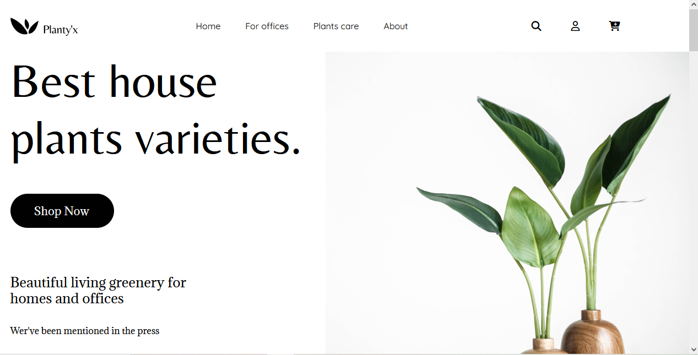

# 🌿 Planty'X

**Planty'X** is a responsive and visually appealing landing page for a plant and gardening-related business. Designed using **HTML**, **CSS**, and **JavaScript**,
the site features a clean layout and a functional image slider. The project lays the groundwork for future enhancements to create a fully interactive and dynamic user experience.

---

## 🔗 Live Demo & Source Code

- 🌐 **Live Website:** [Planty'X](https://robimankhinstart.github.io/Planty-x/)
- 💻 **GitHub Repository:** [github.com/RobiMankhinStart/Planty-x](https://github.com/RobiMankhinStart/Planty-x)

---

## 🧰 Technologies Used

- **HTML5**
- **CSS3**
- **JavaScript (Vanilla)**

---

## 📸 Screenshot



---

## ✨ Features

- 📱 **Responsive Design** – Works well on all devices
- 🎞️ **Image Slider** – Adds visual interaction to the layout
- 💚 Clean and simple UI/UX for plant lovers and eco-conscious users

---

## 🚀 Getting Started

To view or run the project locally:

1. **Clone the repository:**
   ```bash
   git clone https://github.com/RobiMankhinStart/Planty-x.git

---

## 📦 Future Plans
Add full JavaScript functionality for forms and cart

Include more interactive elements like filters, navigation, and product features

Improve accessibility and performance

Possibly convert it into a SPA using React in the future

🙌 Author
Created with 💚 by Robi Mankhin
